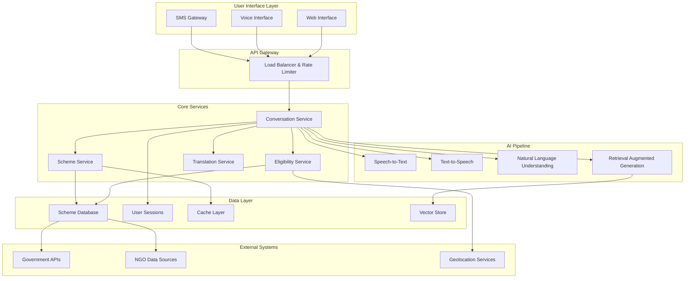
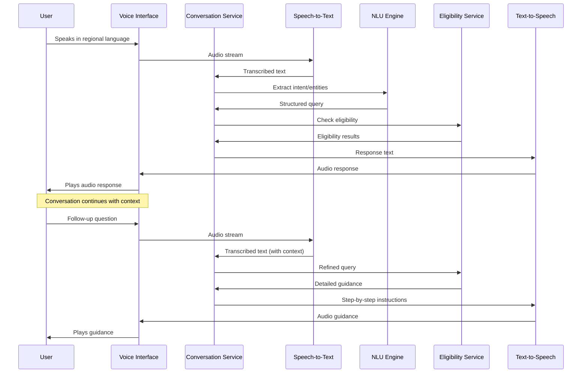
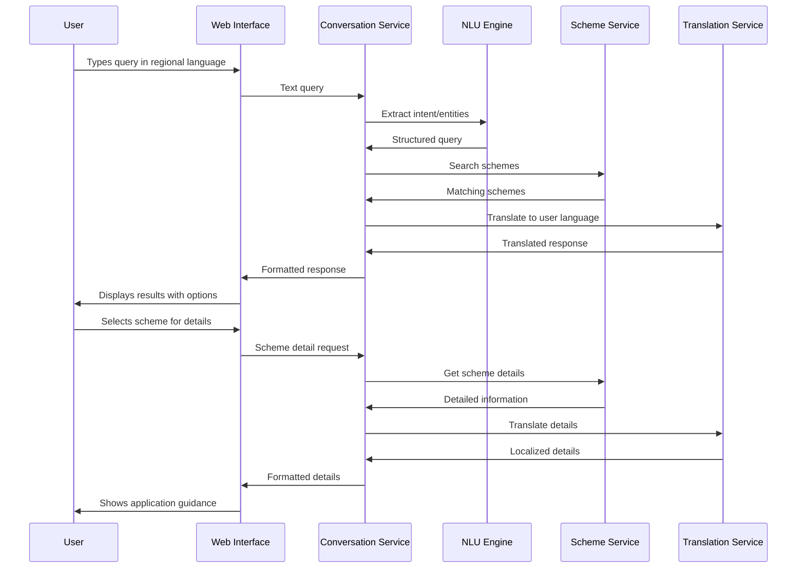
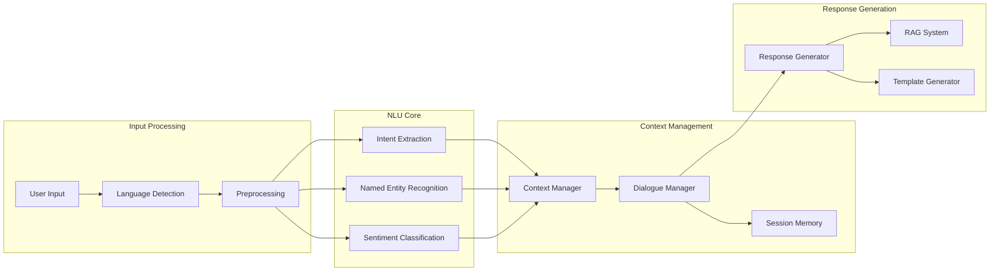
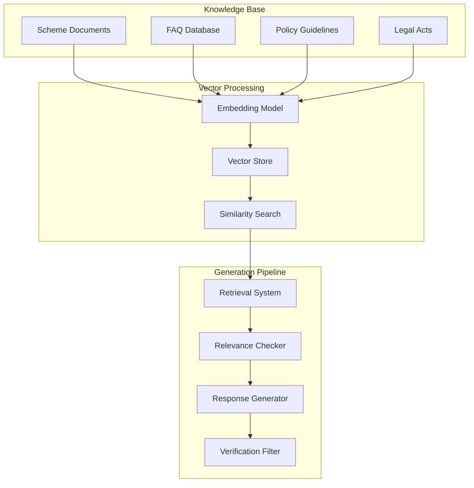
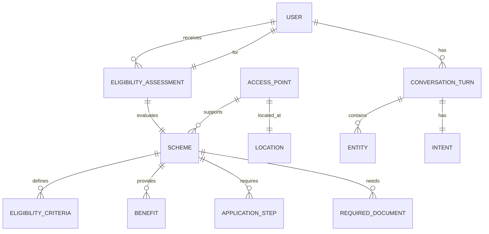
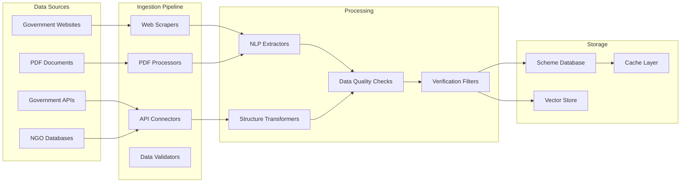
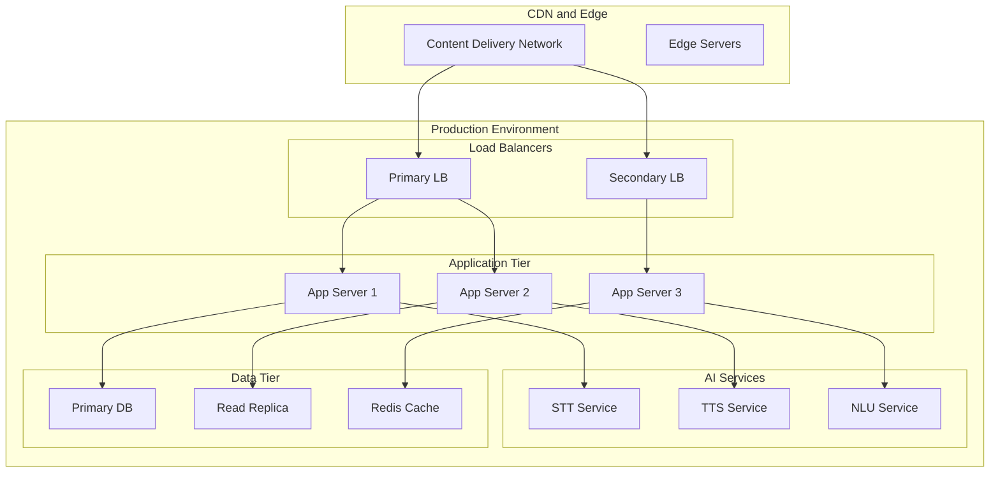

# Design Document

## Overview

The AI-powered Civic Assistant is a voice-first, multilingual system designed to democratize access to government services for underserved communities. The system employs a microservices architecture with specialized AI components for natural language understanding, speech processing, and eligibility assessment. The design prioritizes accessibility, low-bandwidth operation, and cultural sensitivity while maintaining high accuracy and trust through verified data sources.

## Architecture

### High-Level System Architecture



### Component Responsibilities

**User Interface Layer**
- Web Interface: Progressive web app for smartphone and desktop access
- Voice Interface: Optimized voice interaction with noise cancellation
- SMS Gateway: Fallback text-based interaction for basic phones

**API Gateway**
- Load balancing across service instances
- Rate limiting to prevent abuse
- Authentication and authorization
- Request routing and protocol translation

**Core Services**
- Conversation Service: Orchestrates user interactions and maintains context
- Eligibility Service: Assesses user eligibility for schemes
- Scheme Service: Manages scheme information and search
- Translation Service: Handles multilingual content translation

**AI Pipeline**
- Speech-to-Text: Converts voice input to text in regional languages
- Text-to-Speech: Generates natural speech output
- Natural Language Understanding: Extracts intent and entities from user queries
- Retrieval Augmented Generation: Provides contextual responses using verified data

## User Interaction Flow

### Voice-Based Journey



### Text-Based Journey



## AI Architecture

### Natural Language Understanding Pipeline



### Speech-to-Text (STT) Pipeline

**Architecture Components:**
- **Audio Preprocessing**: Noise reduction, normalization, and segmentation
- **Acoustic Model**: Deep neural network trained on regional language audio
- **Language Model**: N-gram and transformer models for regional languages
- **Decoder**: Beam search decoder with language-specific optimizations

**Regional Language Support:**
- Hindi, Bengali, Telugu, Marathi, Tamil, Gujarati, Kannada, Malayalam, Punjabi, Odia
- Accent adaptation for rural and urban variations
- Noise robustness for outdoor and crowded environments
- Low-latency streaming recognition for real-time interaction

### Text-to-Speech (TTS) Pipeline

**Architecture Components:**
- **Text Preprocessing**: Normalization, abbreviation expansion, number conversion
- **Phonetic Analysis**: Grapheme-to-phoneme conversion for regional languages
- **Prosody Prediction**: Stress, intonation, and rhythm modeling
- **Audio Synthesis**: Neural vocoder for natural speech generation

**Voice Characteristics:**
- Gender-neutral, warm, and trustworthy voice persona
- Regional accent adaptation based on user location
- Emotional tone adjustment for empathetic responses
- Variable speech rate based on content complexity

### Retrieval Augmented Generation (RAG)



**RAG Implementation:**
- **Embedding Model**: Multilingual sentence transformers fine-tuned on government documents
- **Vector Store**: FAISS or Pinecone for efficient similarity search
- **Retrieval Strategy**: Hybrid search combining semantic and keyword matching
- **Generation Model**: Fine-tuned language model for government domain
- **Verification Layer**: Fact-checking against authoritative sources

## Data Models

### Core Data Structures

```typescript
interface User {
  sessionId: string;
  preferredLanguage: string;
  location: {
    state: string;
    district: string;
    pincode?: string;
  };
  demographics?: {
    age?: number;
    gender?: string;
    occupation?: string;
    income?: number;
    category?: string; // SC/ST/OBC/General
  };
  conversationHistory: ConversationTurn[];
}

interface Scheme {
  id: string;
  name: string;
  description: string;
  category: SchemeCategory;
  eligibilityCriteria: EligibilityCriteria;
  benefits: Benefit[];
  applicationProcess: ApplicationStep[];
  requiredDocuments: Document[];
  deadlines: Deadline[];
  geographicScope: GeographicScope;
  sourceUrl: string;
  lastUpdated: Date;
  verificationStatus: VerificationStatus;
}

interface EligibilityCriteria {
  age?: AgeRange;
  income?: IncomeRange;
  occupation?: string[];
  category?: string[];
  gender?: string;
  location?: GeographicScope;
  customCriteria?: CustomCriterion[];
}

interface ConversationTurn {
  timestamp: Date;
  userInput: string;
  intent: string;
  entities: Entity[];
  systemResponse: string;
  language: string;
  confidence: number;
}

interface ApplicationGuidance {
  schemeId: string;
  steps: ApplicationStep[];
  documents: RequiredDocument[];
  accessPoints: AccessPoint[];
  timeline: string;
  tips: string[];
}
```

### Data Relationships



## Data Layer

### Data Sources and Ingestion

**Government Data Sources:**
- Ministry websites and portals (e.g., MyGov, Digital India)
- State government scheme databases
- District collector offices and local administration
- Public sector bank scheme information
- Educational institution scholarship databases

**NGO and Partner Sources:**
- Verified NGO program databases
- Community organization resources
- Local implementation partner data
- Field worker feedback and updates

**Data Ingestion Strategy:**


### Source Verification Process

**Verification Levels:**
1. **Primary Sources**: Official government websites and APIs (Highest trust)
2. **Secondary Sources**: Verified NGO partners and local administrators
3. **Tertiary Sources**: Community feedback and field reports (Requires validation)

**Verification Workflow:**
- Automated source credibility scoring
- Cross-reference verification across multiple sources
- Manual review for conflicting information
- Regular freshness checks and update notifications
- Audit trail maintenance for all data changes

### Data Quality Assurance

**Quality Metrics:**
- **Completeness**: All required fields populated
- **Accuracy**: Information matches official sources
- **Consistency**: No contradictions across related schemes
- **Timeliness**: Information updated within 24 hours of changes
- **Relevance**: Schemes applicable to target user base

**Quality Control Process:**
- Automated data validation rules
- Machine learning anomaly detection
- Human expert review for critical updates
- User feedback integration for continuous improvement
- Regular audits against official government publications

## Accessibility and Inclusion Design

### Universal Design Principles

**Principle 1: Equitable Use**
- Multiple interaction modalities (voice, text, SMS)
- Language options covering 95% of target population
- Cultural sensitivity in content and interaction design
- No discrimination based on literacy or technical skills

**Principle 2: Flexibility in Use**
- Adjustable speech rate and volume
- Scalable text size and high contrast options
- Multiple input methods (touch, voice, keyboard)
- Customizable interface based on user preferences

**Principle 3: Simple and Intuitive Use**
- Conversational interaction patterns
- Progressive disclosure of information
- Clear navigation with breadcrumbs
- Consistent terminology and mental models

**Principle 4: Perceptible Information**
- Audio descriptions for visual content
- Visual indicators for audio feedback
- Multiple sensory channels for critical information
- Clear contrast and readable fonts

**Principle 5: Tolerance for Error**
- Graceful error handling with helpful suggestions
- Undo functionality for user actions
- Confirmation for critical operations
- Recovery options for interrupted sessions

### Specific Accessibility Features

**Visual Accessibility:**
- Screen reader compatibility (NVDA, JAWS, TalkBack)
- High contrast mode with customizable color schemes
- Scalable fonts up to 200% without horizontal scrolling
- Alternative text for all images and icons
- Focus indicators for keyboard navigation

**Auditory Accessibility:**
- Visual captions for all audio content
- Sign language interpretation for critical information
- Adjustable audio playback speed
- Visual feedback for audio prompts
- Text-based alternatives for all voice interactions

**Motor Accessibility:**
- Voice commands for all navigation functions
- Large touch targets (minimum 44px)
- Gesture alternatives for complex interactions
- Keyboard shortcuts for power users
- Switch control compatibility

**Cognitive Accessibility:**
- Simple language with grade 6 reading level
- Consistent navigation patterns
- Progress indicators for multi-step processes
- Memory aids and conversation history
- Timeout warnings with extension options

## Security, Privacy, and Ethics

### Security Architecture

**Authentication and Authorization:**
- Anonymous access for general information
- Optional user accounts for personalized services
- Multi-factor authentication for sensitive operations
- Role-based access control for administrative functions

**Data Protection:**
- End-to-end encryption for all user communications
- AES-256 encryption for data at rest
- TLS 1.3 for data in transit
- Regular security audits and penetration testing
- GDPR and local data protection compliance

**Infrastructure Security:**
- Container-based deployment with security scanning
- Network segmentation and firewall protection
- Regular security updates and patch management
- Intrusion detection and monitoring systems
- Backup and disaster recovery procedures

### Privacy Framework

**Data Minimization:**
- Collect only essential information for service delivery
- Automatic deletion of personal data after session completion
- Opt-in consent for data retention and personalization
- Granular privacy controls for users

**Transparency:**
- Clear privacy policy in all supported languages
- Data usage explanations before collection
- User dashboard showing collected data
- Easy data export and deletion options

**User Control:**
- Granular consent management
- Real-time privacy preference updates
- Data portability and deletion rights
- Audit logs of data access and usage

### Ethical Considerations

**Algorithmic Fairness:**
- Regular bias testing across demographic groups
- Diverse training data representing all user communities
- Fairness metrics monitoring and reporting
- Community feedback integration for bias detection

**Transparency and Explainability:**
- Clear explanations for eligibility decisions
- Confidence scores for AI-generated responses
- Source attribution for all information provided
- Appeals process for disputed eligibility assessments

**Digital Divide Mitigation:**
- Offline capability for essential functions
- Low-bandwidth optimization for rural areas
- Multiple access channels (web, SMS, voice)
- Community access points and digital literacy support

**Cultural Sensitivity:**
- Local cultural norms integration in interaction design
- Community leader involvement in system design
- Respectful representation of diverse communities
- Continuous cultural competency training for AI models

## Deployment and Scalability

### Deployment Architecture



### Scalability Strategy

**Horizontal Scaling:**
- Microservices architecture for independent scaling
- Container orchestration with Kubernetes
- Auto-scaling based on CPU, memory, and request metrics
- Database sharding for large-scale data distribution

**Performance Optimization:**
- CDN for static content delivery
- Edge computing for reduced latency
- Caching strategies at multiple layers
- Database query optimization and indexing

**Geographic Distribution:**
- Multi-region deployment for disaster recovery
- Regional data centers for compliance requirements
- Edge servers in rural areas for improved access
- Local language model deployment for reduced latency

### Monitoring and Observability

**Application Monitoring:**
- Real-time performance metrics and alerting
- User experience monitoring and analytics
- Error tracking and automated incident response
- Capacity planning and resource utilization tracking

**AI Model Monitoring:**
- Model performance drift detection
- Accuracy metrics tracking across languages
- Bias monitoring and fairness assessments
- A/B testing for model improvements

**Business Metrics:**
- User adoption and engagement tracking
- Scheme application success rates
- Geographic usage patterns and trends
- Community impact measurement and reporting

### Maintenance and Updates

**Continuous Integration/Deployment:**
- Automated testing and quality assurance
- Blue-green deployment for zero-downtime updates
- Feature flags for gradual rollout
- Rollback procedures for failed deployments

**Data Updates:**
- Automated scheme information synchronization
- Manual review process for critical updates
- Version control for all data changes
- Impact assessment for scheme modifications

**Model Updates:**
- Regular retraining with new data
- A/B testing for model improvements
- Gradual rollout of updated models
- Performance monitoring during transitions

## Correctness Properties

*A property is a characteristic or behavior that should hold true across all valid executions of a system—essentially, a formal statement about what the system should do. Properties serve as the bridge between human-readable specifications and machine-verifiable correctness guarantees.*

### Property 1: Speech Recognition Accuracy
*For any* supported regional language audio input with acceptable quality, the Voice_Interface should convert speech to text with at least 85% accuracy
**Validates: Requirements 1.1**

### Property 2: Text-to-Speech Conversion
*For any* text response in a supported language, the Voice_Interface should generate natural speech audio in the user's preferred language
**Validates: Requirements 1.2**

### Property 3: Speech Quality Error Handling
*For any* audio input with poor quality (noise, unclear speech), the Voice_Interface should request clarification from the user
**Validates: Requirements 1.3, 1.4**

### Property 4: Multilingual Conversation Continuity
*For any* language switch during a conversation, the Civic_Assistant should continue the conversation seamlessly in the new language while preserving context
**Validates: Requirements 2.2**

### Property 5: Translation Accuracy Preservation
*For any* government scheme information translation, the essential eligibility criteria and requirements should be preserved accurately across languages
**Validates: Requirements 2.3**

### Property 6: Language Detection Accuracy
*For any* user input in a supported language, the Civic_Assistant should automatically detect the correct language
**Validates: Requirements 2.5**

### Property 7: Comprehensive Eligibility Assessment
*For any* user profile with complete demographic information, the Eligibility_Engine should evaluate eligibility across all applicable schemes in the database
**Validates: Requirements 3.1**

### Property 8: Eligibility Explanation Transparency
*For any* eligibility decision (positive or negative), the Eligibility_Engine should provide a clear explanation of the reasoning and suggest alternatives when applicable
**Validates: Requirements 3.2, 3.5**

### Property 9: Scheme Ranking Consistency
*For any* user profile with multiple eligible schemes, the Eligibility_Engine should rank schemes consistently by relevance and benefit amount
**Validates: Requirements 3.3**

### Property 10: Information Gathering Completeness
*For any* incomplete user profile, the Eligibility_Engine should ask appropriate clarifying questions to gather missing essential information
**Validates: Requirements 3.4**

### Property 11: Comprehensive Scheme Retrieval
*For any* assistance query, the Civic_Assistant should retrieve all relevant schemes from the database that match the query intent
**Validates: Requirements 4.1**

### Property 12: Information Simplification Consistency
*For any* complex bureaucratic information, the Civic_Assistant should translate it into simple, actionable language appropriate for the target literacy level
**Validates: Requirements 4.2**

### Property 13: Complete Scheme Information
*For any* scheme details request, the Civic_Assistant should provide all essential information including deadlines, documents, benefits, and access points
**Validates: Requirements 4.3, 4.5**

### Property 14: Geographic Filtering Accuracy
*For any* user location and scheme with geographic restrictions, the Civic_Assistant should correctly filter results based on location eligibility
**Validates: Requirements 4.4**

### Property 15: Complete Application Guidance
*For any* scheme application request, the Civic_Assistant should provide comprehensive guidance including document checklists, simplified steps, and recommended methods
**Validates: Requirements 5.1, 5.2, 5.3**

### Property 16: Deadline Alert Timeliness
*For any* scheme with approaching deadlines, the Civic_Assistant should provide timely alerts about time-sensitive requirements
**Validates: Requirements 5.4**

### Property 17: Low-Bandwidth Optimization
*For any* poor network conditions, the Civic_Assistant should optimize data usage through compression, caching, and alternative modes while maintaining functionality
**Validates: Requirements 6.1, 6.2, 6.3, 6.5**

### Property 18: Conversation Recovery
*For any* connection interruption during interaction, the Civic_Assistant should resume the conversation from the last successful exchange point
**Validates: Requirements 6.4**

### Property 19: Data Source Verification
*For any* information provided to users, the Civic_Assistant should ensure it comes from verified official sources and includes proper attribution
**Validates: Requirements 7.1, 7.3**

### Property 20: Information Freshness
*For any* scheme information update from official sources, the Scheme_Database should reflect changes within 24 hours
**Validates: Requirements 7.2**

### Property 21: Data Encryption Compliance
*For any* personal information collected or stored, the Civic_Assistant should apply appropriate encryption in transit and at rest
**Validates: Requirements 8.1**

### Property 22: Privacy-by-Design Data Handling
*For any* user session, personal information should be automatically deleted after eligibility assessment unless explicit consent for storage is provided
**Validates: Requirements 8.2**

### Property 23: Data Deletion Responsiveness
*For any* user data deletion request, the Civic_Assistant should remove all personal information within 24 hours
**Validates: Requirements 8.3**

### Property 24: Accessibility Mode Availability
*For any* user with disabilities, the Civic_Assistant should provide appropriate interaction modes (audio-only, text-only, voice navigation) based on accessibility needs
**Validates: Requirements 9.1, 9.2, 9.3**

### Property 25: Assistive Technology Compatibility
*For any* standard assistive technology (screen readers, voice control), the Civic_Assistant should provide compatible interfaces and responses
**Validates: Requirements 9.4**

### Property 26: Performance Under Load
*For any* normal operating conditions with up to 10,000 concurrent users, the Civic_Assistant should maintain response times under 3 seconds
**Validates: Requirements 10.1, 10.3**

### Property 27: Auto-Scaling Effectiveness
*For any* increased user load beyond normal capacity, the Civic_Assistant should maintain performance through automatic resource scaling
**Validates: Requirements 10.2**

### Property 28: System Reliability
*For any* extended operating period, the Civic_Assistant should maintain 99.5% uptime availability with minimal planned downtime
**Validates: Requirements 10.5**

## Error Handling

### Error Categories and Responses

**Speech Processing Errors:**
- Audio quality issues: Request clearer speech with helpful tips
- Unsupported language: Gracefully inform user and suggest alternatives
- Recognition failures: Offer text input as fallback option

**Data and Connectivity Errors:**
- Network timeouts: Retry with exponential backoff, offer cached information
- Database unavailability: Provide cached responses and schedule retry
- API failures: Fallback to alternative data sources or manual guidance

**User Input Errors:**
- Incomplete information: Ask specific clarifying questions
- Invalid data: Provide clear validation messages and examples
- Ambiguous queries: Offer clarification options and suggestions

**System Errors:**
- Service unavailability: Provide clear status and estimated recovery time
- Processing failures: Log errors, provide user-friendly messages
- Authentication issues: Guide users through resolution steps

### Error Recovery Strategies

**Graceful Degradation:**
- Voice unavailable → Text interaction
- Real-time data unavailable → Cached information
- Full features unavailable → Core functionality only

**User Communication:**
- Clear, non-technical error messages
- Actionable steps for resolution
- Alternative methods to achieve goals
- Contact information for human assistance

## Testing Strategy

### Dual Testing Approach

The testing strategy employs both unit testing and property-based testing to ensure comprehensive coverage:

**Unit Tests:**
- Focus on specific examples, edge cases, and error conditions
- Test integration points between components
- Validate specific user scenarios and workflows
- Test accessibility features with assistive technologies

**Property-Based Tests:**
- Verify universal properties across all inputs using randomized testing
- Test system behavior with generated user profiles, queries, and scenarios
- Validate correctness properties with minimum 100 iterations per test
- Each property test references its corresponding design document property

### Property-Based Testing Configuration

**Testing Framework:** Hypothesis (Python) or fast-check (TypeScript/JavaScript)
**Test Configuration:**
- Minimum 100 iterations per property test
- Custom generators for user profiles, schemes, and queries
- Shrinking enabled for minimal failing examples
- Timeout configuration for long-running tests

**Test Tagging Format:**
Each property-based test must include a comment with the format:
**Feature: civic-assistant, Property {number}: {property_text}**

Example:
```python
# Feature: civic-assistant, Property 7: Comprehensive Eligibility Assessment
def test_comprehensive_eligibility_assessment(user_profile):
    eligible_schemes = eligibility_engine.assess(user_profile)
    all_schemes = scheme_database.get_all_schemes()
    expected_schemes = [s for s in all_schemes if meets_criteria(user_profile, s)]
    assert set(eligible_schemes) == set(expected_schemes)
```

### Testing Coverage Areas

**Functional Testing:**
- Speech-to-text accuracy across languages and accents
- Text-to-speech quality and naturalness
- Eligibility assessment accuracy and completeness
- Information retrieval and filtering
- Multilingual translation accuracy

**Performance Testing:**
- Response time under various load conditions
- Concurrent user capacity testing
- Low-bandwidth performance validation
- Auto-scaling effectiveness

**Accessibility Testing:**
- Screen reader compatibility
- Voice navigation functionality
- Visual and motor accessibility features
- Multi-modal interaction testing

**Security Testing:**
- Data encryption validation
- Privacy compliance verification
- Authentication and authorization testing
- Vulnerability assessment and penetration testing

**Integration Testing:**
- End-to-end user journey validation
- External API integration testing
- Database consistency and reliability
- Cross-service communication testing

### Continuous Testing Strategy

**Automated Testing Pipeline:**
- Unit and property tests run on every code commit
- Integration tests run on staging environment
- Performance tests run nightly
- Security scans run weekly

**User Acceptance Testing:**
- Community beta testing with target user groups
- Accessibility testing with users with disabilities
- Multilingual testing with native speakers
- Usability testing in real-world conditions

**Monitoring and Feedback:**
- Real-time error tracking and alerting
- User feedback collection and analysis
- Performance monitoring and optimization
- Continuous improvement based on usage patterns